```{r setup, echo = F}
knitr::opts_chunk$set(
  comment = "#",
  #cache = TRUE,
  collapse = TRUE,
  warning = FALSE,
  message = FALSE,
  fig.width = 7,
  fig.height = 5.25,
  fig.align = 'center',
  fig.retina = 3
)

# base plot layout
mypar = list(mar = c(3,3,0.5,0.5), mgp = c(1.5, 0.3, 0), tck = -.008)

# xaringan Extra
xaringanExtra::use_xaringan_extra(c("tile_view", "animate_css", "tachyons"))
xaringanExtra::use_extra_styles(
  hover_code_line = TRUE,         #<<
  mute_unhighlighted_code = TRUE  #<<
)
xaringanExtra::use_editable(expires = 1)
xaringanExtra::use_panelset()
```
class: middle, title-slide

<!-- top logo (comment to remove or edit on `conf/css/style.css:23`) -->
<div class="lab-logo"></div>
<div class="uni-logo"></div>

# Predicting diversity with *Joint Species Distribution Models*

<hr width="65%" align="left" size="0.3" color="yellow"></hr>

## A difficult case with species rich marine benthic communities

### <b>Clément Violet</b>, .small[DYNECO - LEBCO] <br><b>Aurélien Boyé</b>, .small[DYNECO - LEBCO]<br><b>Olivier Gauthier</b>, .small[LEMAR]<br><b>Jacques Grall</b>, .small[IUEM - Observatoire]<br><b>Stanislas Dubois</b>, .small[DYNECO - LEBCO]<br><b>Martin Marzloff</b>, .small[DYNECO - LEBCO]

.date[09/04/2021]

---
class: middle, center, inverse

# Introduction
<hr width="100%" align="left" size="0.3" color="yellow"></hr>
---
# Assembly Rules Framework

.center[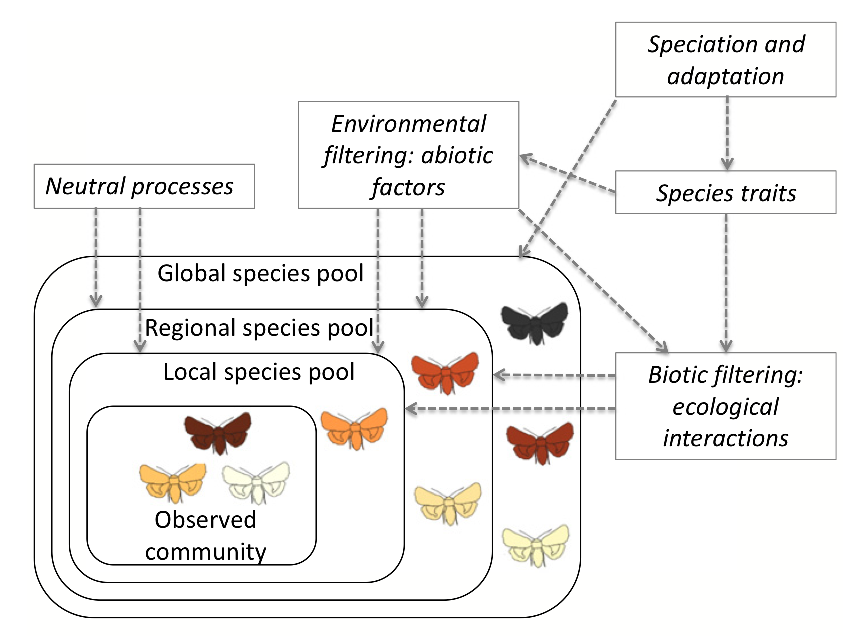]
.citeb[Ovaskainen et al. [2017](https://doi.org/10.1111/ele.12757), Ecol. Lett.]

---
# Assembly Rules Framework

.center[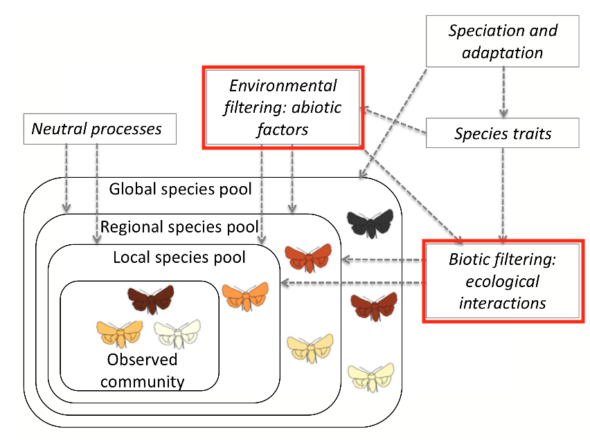]
.citeb[Ovaskainen et al. [2017](https://doi.org/10.1111/ele.12757), Ecol. Lett.]

---
# *Species Distribution Models*

Strategies for modelling a community:

.citeb[Ferrier and Guisan [2006](https://doi.org/10.1111/j.1365-2664.2006.01149.x), J. Appl. Ecol.]

*Predict first, assemble later*

.center[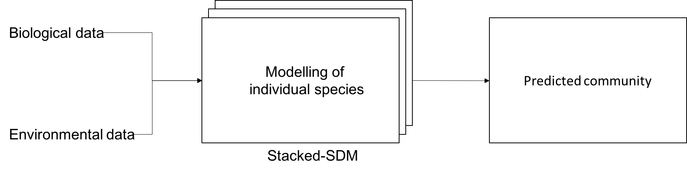]

--

*Assemble and predict together*

.center[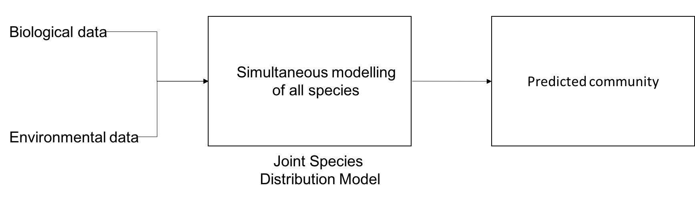]

---
# *Joint Species Distribution Models*

<br><br><br><br><br>

.center[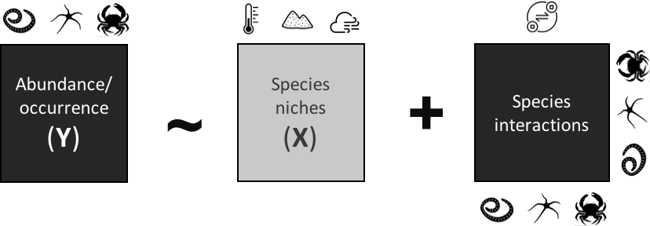]

???

Pour prendre en compte l'influence et l'interdépendance entre chaque espèce une première solution est d'estimer la matrice de variance-covariance à partir d'un effet aléatoire. Mais estimer entièrement cette matrice est rapidement difficile, car le nombre de paramètres à estimer croit au carré avec le nombre d'espèces.

---
# *Joint Species Distribution Models*

.center[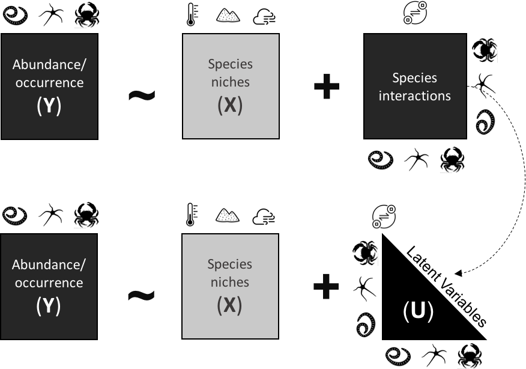]

.citeb[Warton et al., [2015](https://doi.org/10.1016/j.tree.2015.09.007) Trends Ecol. Evol.]

---
# Prediction accuracy & species interactions

- *JSDM* predict the occurence of species more accuratly than SDM

  - But predict interactions is at best difficult from co-occurence data.
.citeb[Norberg et al., [2019](https://doi.org/10.1002/ecm.1370) Ecological Monographs ; Blanchet, Cazelles and Gravel [2020](https://doi.org/10.1111/ele.13525) Ecol. Lett.]

- Using abundance data could be a solution to infer species interactions

--

<br><br><br>

.center[**Before trying to infer interactions, are we predicting accurately a community of interest?**]

---
class: middle, center, inverse

# Material & methods
<hr width="100%" align="left" size="0.3" color="yellow"></hr>
---

# Study Case
December 1999...

.pull-left[]

.pull-right[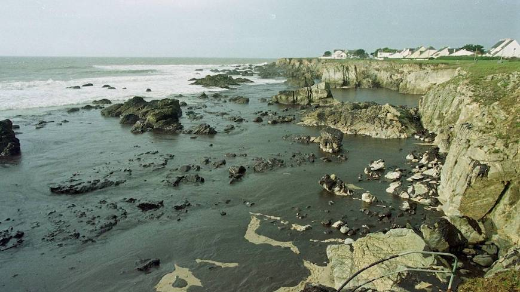]

--
<br><br>
...2003

.center[]

---
# Study Case - Habitat

- 21 training sites + 2 holdout validation sites
- 9 years of sampling (2006 - 2014)
- 2 habitats (seagrass meadows / intertidal bare sediments)

.pull-left[.center[
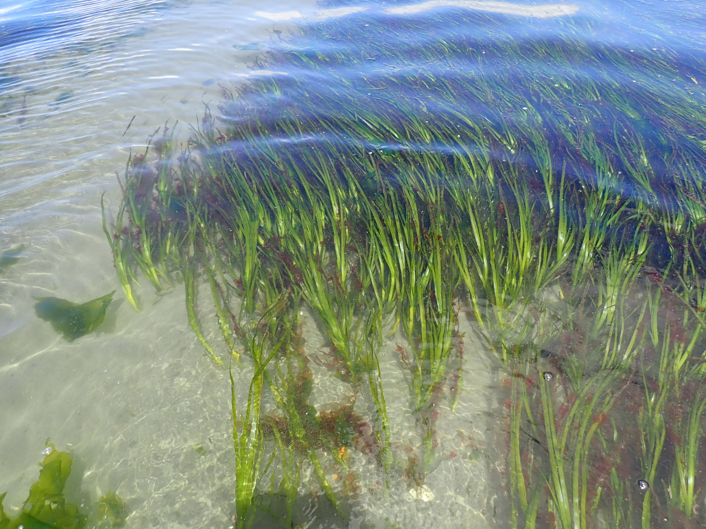
.font80[*Zostera marina*, seagrass meadow]]]
.pull-right[.center[

.font80[Mont Saint-Michel, intertidal bare sediments]]]

---
# Study Case - Community

Polychaeta

.center[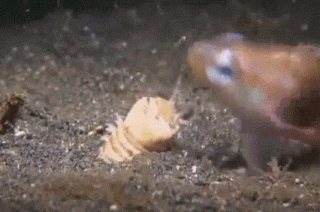<br>.font80[*Eunice aphroditois*, which ~~unfortunately~~ does not inhabit our shores...]]
.citeb[[spotmydive.com](https://www.spotmydive.com/en/marine-life/bobbitt-worm-evil-has-a-new-name)]

---
# Model backbone
- *Hierarchical Modelling of Species Communities* (*HMSC*)
- Multivariate hierachical GLMM fitted with Bayesian inference
- *HMSC* relies on assembly rules framework

.center[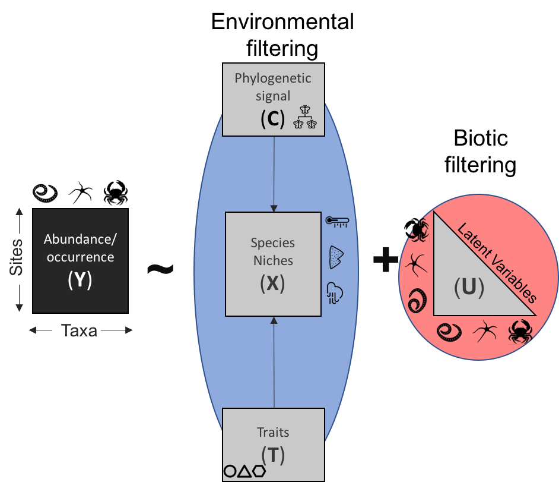]

---
# Candidate Models

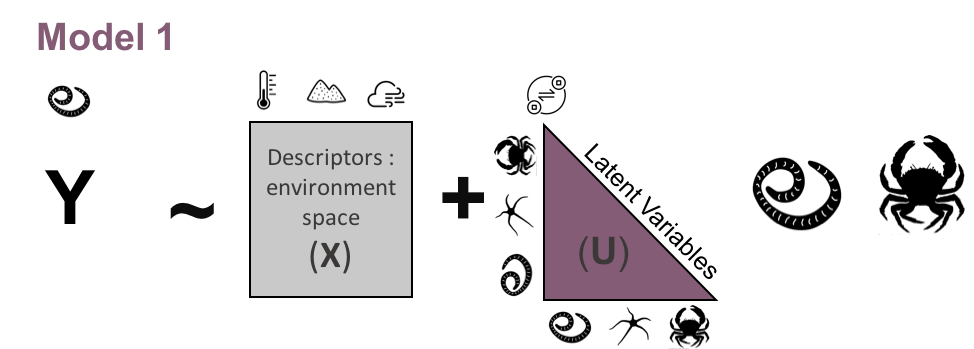

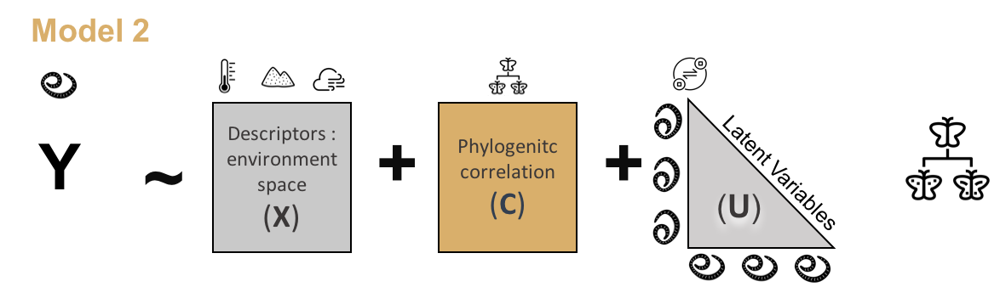

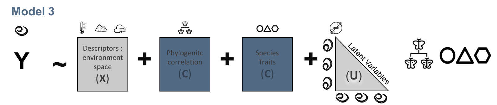

---
# Diversity patterns

What is the best strategy to predict:

.pull-left[
1. Community structure?

2. Species richness?

3. Species-specific abundance

]

.pull-right[
.center[
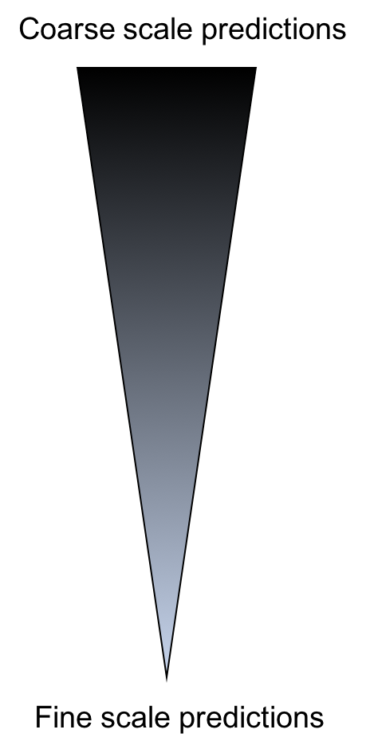
]
]
---

# Diversity patterns

.pull-left[
What is the best strategy to predict:
1. Community structure? .citeb[[1] De Cáceres and Legendre [2013](https://doi.org/10.1111/ele.12141), Ecol. Let.]

  - Mean Absolute Error on Local Contribution to Beta Diversity (LCBD) .font60[[1]]

2. Species richness?

  - Mean Absolute Error on species richness

3. Species-specific abundance

  - $R^2 = r_p(y, \hat{y})$
]

.pull-right[
.center[
]
]

---
# Predict Community Structure

.font60[Local Contribution to Beta Diversity]

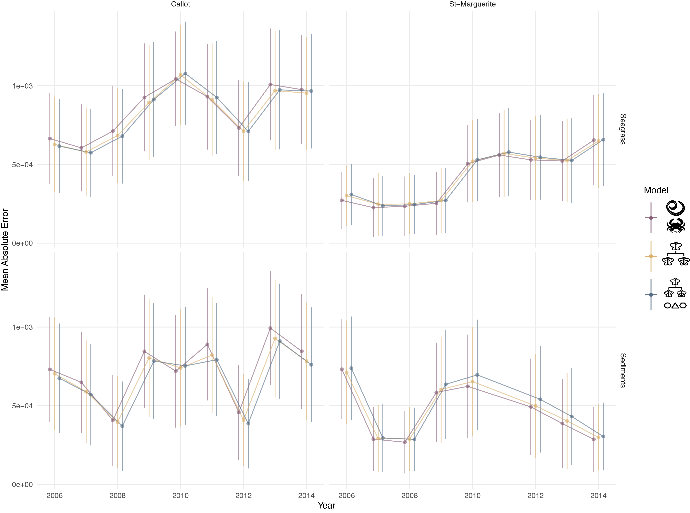

---
# Predict Species Richness

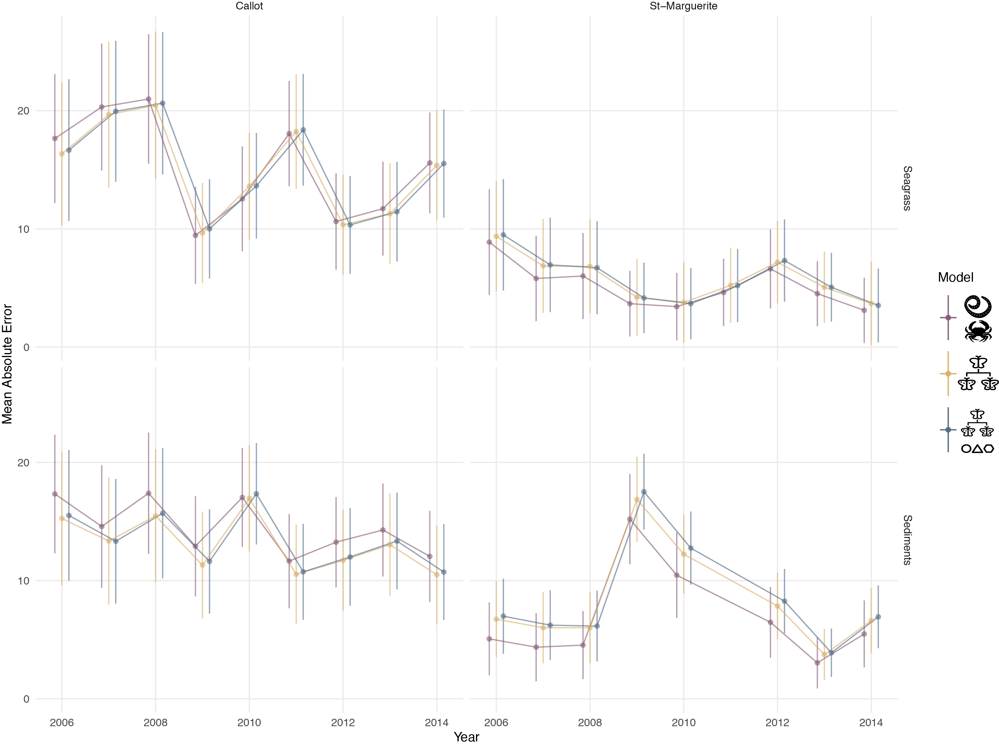

---
# Species-specific abundance accuracy

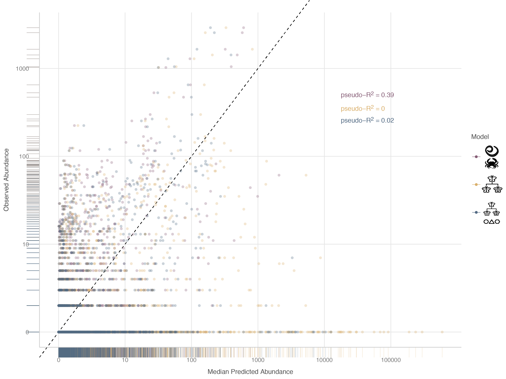

---

# Conclusion

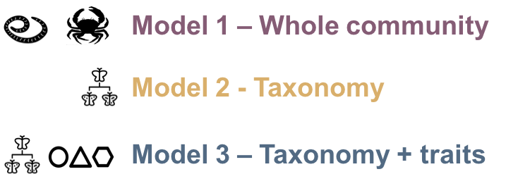

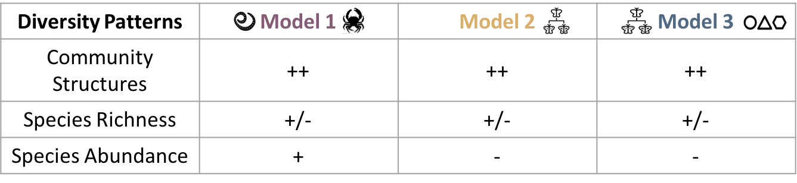

--
Which strategy to choose?
- Best accuracy with the whole community

--

- Traits are a valuable addition

--

- Interactions ?

---
class: inverse
# Work in Progress

- Community trajectory analysis

- Add intercept models

--

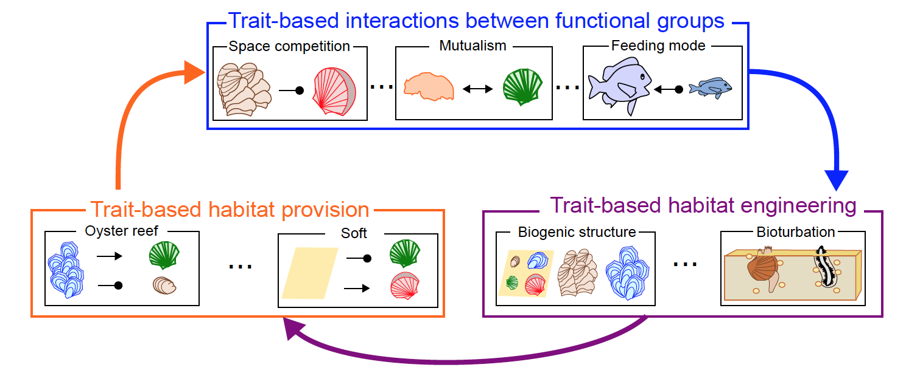

.citeb[Go et al., In Prep.]
